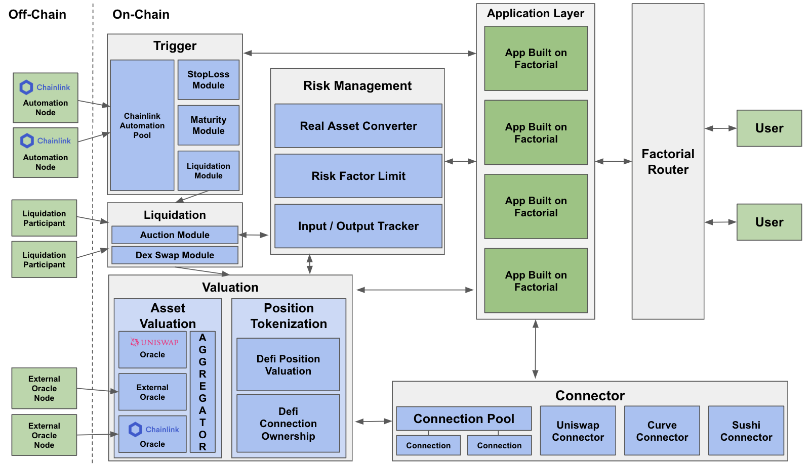

#  **Factorial**

**A smart contract library for easy and secure DeFi development.**
Easy to Build, Hard to Rug.

## Overview

This repository is for ETHDenver2023 BUIDLathon.
We provide contracts and deployment scripts.

### Depolyment and Test

You can do the test in local Hardhat environment, use the following commands.

First, run a hardhat node using:

```shell
nvm use 14.17.0
yarn install
yarn hardhat node
```

Then, run the script for deployment in another terminal using:

```shell
nvm use 14.17.0
yarn hardhat run scripts/deploy-local.ts --network localhost
```

## Factorial Architecture

Factorial consists of the following contracts.



### Factorial Router

Factorial Router forwards the user's request to the corresponding app under the supervision of Risk management.

### Connector

Connector is the abstract layer connecting to external DeFi.
Connector consists of `Connection Pool`, `Connection`, and a specific `Connector`, where `Connection Pool` manages `Connection`.
`Connection` is a contract to make DeFi position as NFT.
Since the DeFi position is NFT-tokenized, the Connector module of Fatorial does not require to manage unnecessary state values in order to prove the ownership of the DeFi positions.

### Liquidation

Liquidation enables the apps on Factorial to enjoy a shared liquidation environments.
Factorial can provide various types of liquidation, e.g., simple swap liquidation and auction liquation, where the liquidation type can be added continuously.

### Risk Management

Risk Management monitors and restricts the asset flow by transactions.
This consists of the functionalities as asset management and limition of risk factor.
`Asset Management` converts user's assets(ERC20) into factorial assets and give them to the app.
This can prevent malicious losses by tracking the changes of the user assets.
`Asset Management` of Factorial does not require the process of approval in order to remove the potential risk.

### Trigger

Trigger module enables the App on Factorial to provide various actions that require Trigger, e.g., Liquidate, Stop-loss, take-profit, maturity.
Automation pool provides the connection with external automation triggerer, e.g., Chainlink automation node.

### Valuation

Valuation module measures the value of a DeFi position by using tokenization with external oracles.
`Tokenization` turns a DeFi position into a token (i.e., ERC1155) so that it can be easily valuated and collateralized.


## More Information

Check it out more about `Factorial`!

- [Website](https://factorial-1.gitbook.io/factorial) 
- [Docs](https://factorial-1.gitbook.io/factorial)
- [YouTube](https://www.youtube.com/channel/UC8s9PaQbGHehm5dtU_sOJdQ)
- [Twitter](https://twitter.com/FactorialFi)
- [Telegram](https://t.me/factorialfi)
- [Discord](https://discord.gg/zggTQdDtZM)

If you have any feedback&comment, please visit [Feedback](https://airtable.com/shrI1qTxflZLGLmMK) to leave your thought.
